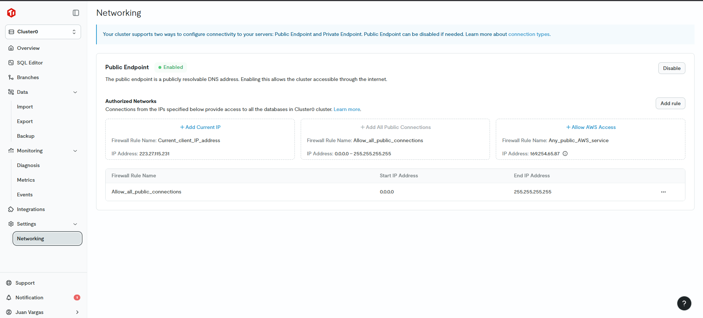

# 🖥️ Guía de Ejecución en Local (Windows)

Esta guía explica cómo ejecutar el proyecto en tu computadora local.

---

## 📋 Requisitos Previos

Antes de empezar, necesitas tener instalado:

| Software | Versión | Descargar |
|----------|---------|-----------|
| **Node.js** | 18+ | https://nodejs.org (descarga la versión LTS) |
| **Git** | Cualquiera | https://git-scm.com/download/win |
| **PowerShell** | 5.1+ | Ya viene en Windows 10/11 |

### Verificar instalación

Abre PowerShell y ejecuta:

```powershell
node --version    # Debe mostrar v18.x.x o superior
npm --version     # Debe mostrar 9.x.x o superior
git --version     # Debe mostrar la versión instalada
```

Si alguno no está instalado, descárgalo e instálalo antes de continuar.

---

## 🚀 Opción 1: Script Automático (Recomendado)

Esta opción ejecuta todo automáticamente con un solo comando.

### Paso 1: Abrir PowerShell

1. Presiona `Win + X`
2. Selecciona **"Windows PowerShell"** o **"Terminal"**
3. Navega a la carpeta del proyecto:

```powershell
cd C:\Users\[tu-usuario]\Desktop\discord-chat-tidb
```

### Paso 2: Permitir ejecución de scripts

⚠️ **IMPORTANTE**: Windows bloquea scripts por seguridad. Ejecuta:

```powershell
Set-ExecutionPolicy -ExecutionPolicy RemoteSigned -Scope CurrentUser -Force
```

> 💡 **Nota**: Esto solo permite ejecutar scripts en tu sesión actual. Es seguro.

### Paso 3: Ejecutar el script

```powershell
.\start-local.ps1
```

### ¿Qué hace el script?

1. ✅ Instala dependencias del backend
2. ✅ Configura Prisma y crea tablas en TiDB
3. ✅ Carga datos de prueba (3 usuarios, 3 canales, 15 mensajes)
4. ✅ Instala dependencias del frontend
5. ✅ Abre **3 ventanas de PowerShell** con los servidores
6. ✅ Abre automáticamente el navegador

### Resultado esperado

Verás **4 ventanas**:

| Ventana | Contenido | Puerto | Color título |
|---------|-----------|--------|--------------|
| 1 | WebSocket Server | 3002 | Verde |
| 2 | Backend API | 3001 | Azul |
| 3 | Frontend | 5173 | Magenta |
| 4 | Navegador con la app | - | - |

La aplicación estará en: **http://localhost:5173**

---

## 🛠️ Opción 2: Instalación Manual

Si el script automático falla, usa esta opción.

### Paso 1: Instalar Backend

Abre **PowerShell** y ejecuta:

```powershell
# Ir a la carpeta del proyecto
cd C:\Users\[tu-usuario]\Desktop\discord-chat-tidb

# Entrar al backend
cd backend

# Instalar dependencias (esto toma 2-3 minutos)
npm install

# Generar cliente Prisma
npx prisma generate

# Crear tablas en TiDB Cloud
npx prisma db push --accept-data-loss

# Cargar datos de prueba
node ../prisma/seed.js
```

> ⏱️ **Tiempo estimado**: 3-5 minutos

**Si ves errores de conexión a la base de datos**, verifica:
- Tu IP está permitida en TiDB Cloud (ver imagen en tutorial)
- El archivo `backend/.env` tiene las credenciales correctas en la variable `TIDB_DATABASE_URL`

### Paso 2: Instalar Frontend

En la misma ventana de PowerShell:

```powershell
# Volver a la carpeta raíz
cd ..

# Entrar al frontend
cd frontend

# Instalar dependencias (toma 2-3 minutos)
npm install
```

### Paso 3: Iniciar servidores

Necesitas abrir **3 ventanas de PowerShell** separadas:

#### Ventana 1 - WebSocket Server:

```powershell
cd C:\Users\[tu-usuario]\Desktop\discord-chat-tidb\backend
node socket/server.js
```

Debe mostrar:
```
🚀 Servidor WebSocket iniciado
📡 Puerto: 3002
✅ Listo para recibir conexiones...
```

#### Ventana 2 - Backend API:

```powershell
cd C:\Users\[tu-usuario]\Desktop\discord-chat-tidb\backend
npm run dev
```

Debe mostrar:
```
ready - started server on 0.0.0.0:3001, url: http://localhost:3001
```

#### Ventana 3 - Frontend:

```powershell
cd C:\Users\[tu-usuario]\Desktop\discord-chat-tidb\frontend
npm run dev
```

Debe mostrar:
```
VITE v5.x.x  ready in XXX ms
➜  Local:   http://localhost:5173/
```

### Paso 4: Abrir navegador

Ve a: **http://localhost:5173**

---

## 🎮 Cómo probar el chat

1. **Abre dos navegadores diferentes**:
   - Chrome normal: http://localhost:5173
   - Chrome incógnito: http://localhost:5173
   - O Edge: http://localhost:5173

2. **Selecciona usuarios diferentes**:
   - En el primer navegador, selecciona "Alice Johnson"
   - En el segundo navegador, selecciona "Bob Smith"

3. **Envía mensajes**:
   - Escribe un mensaje en uno y presiona Enter
   - Verás que aparece instantáneamente en el otro navegador

4. **Crea un nuevo canal**:
   - Click en el + junto a "Canales de texto"
   - Escribe un nombre y crea
   - Envía mensajes en el nuevo canal

---

## 🛑 Cómo detener los servidores

Para detener la aplicación:

1. **Cierra las 3 ventanas de PowerShell** de los servidores
2. **Cierra el navegador** (opcional)

Los servidores se detendrán automáticamente.

---

## ❌ Solución de Problemas

### Error: "No se puede cargar el archivo porque la ejecución de scripts está deshabilitada"

**Causa**: Windows bloquea scripts PowerShell por seguridad.

**Solución**:
```powershell
Set-ExecutionPolicy -ExecutionPolicy RemoteSigned -Scope CurrentUser -Force
```

Luego intenta ejecutar de nuevo.

---

### Error: "Cannot connect to database" o "Access denied"

**Causa**: Tu IP no está permitida en TiDB Cloud.

**Solución**:

1. Ve a https://tidbcloud.com
2. Selecciona tu cluster
3. Ve a **Settings** → **Networking**
4. Click en **"+ Add Current IP"**
5. Espera 1 minuto y reintenta



---

### Error: "Cannot find module 'prisma'"

**Causa**: Las dependencias no se instalaron correctamente.

**Solución**:
```powershell
cd backend
npm install
npx prisma generate
```

---

### Error: "Port 3001/3002/5173 is already in use"

**Causa**: Otro programa está usando esos puertos.

**Solución**:

Opción A - Cerrar programas:
```powershell
# Ver qué procesos usan esos puertos
netstat -ano | findstr :3001
netstat -ano | findstr :3002
netstat -ano | findstr :5173

# Cerrar el proceso (reemplaza #### con el PID)
taskkill /PID #### /F
```

Opción B - Cambiar puertos:
- Backend: Edita `backend/.env` y cambia `PORT=3001` a `PORT=3005`
- WebSocket: Cambia `WS_PORT=3002` a `WS_PORT=3006`
- Frontend: Edita `frontend/package.json` o usa `npm run dev -- --port 5174`

---

### Error: "Duplicate page detected" o Error 404 en la API

**Causa**: Next.js tiene conflictos entre el nuevo `App Router` (`app/api`) y el antiguo `Pages Router` (`pages/api`).

**Solución**:
Asegúrate de que la carpeta `backend/pages` esté eliminada. El proyecto debe usar únicamente la estructura de `backend/app`.

---

### Error: "The term 'npm' is not recognized"

**Causa**: Node.js no está instalado o no está en el PATH.

**Solución**:
1. Descarga Node.js: https://nodejs.org
2. Instala la versión LTS
3. Cierra y vuelve a abrir PowerShell
4. Verifica: `node --version`

---

### El chat no muestra mensajes en tiempo real

**Causa**: El servidor WebSocket no está corriendo.

**Verificación**:
1. ¿Tienes 3 ventanas de PowerShell abiertas?
2. En la ventana del WebSocket (puerto 3002), ¿ves "✅ Listo para recibir conexiones"?
3. ¿Usas http://localhost:5173 (no https)?

**Solución**: Reinicia los 3 servidores cerrando las ventanas y abriéndolas de nuevo.

---

### Error: "Module not found" o "Cannot resolve"

**Causa**: Dependencias corruptas o faltantes.

**Solución**:
```powershell
# En backend
cd backend
Remove-Item -Recurse -Force node_modules
npm install

# En frontend
cd ../frontend
Remove-Item -Recurse -Force node_modules
npm install
```

---

## 📊 URLs de verificación

Una vez que todo esté corriendo, verifica que funcionan:

| URL | ¿Qué debe mostrar? |
|-----|-------------------|
| http://localhost:3001/api/users | JSON con lista de usuarios |
| http://localhost:3001/api/conversations | JSON con lista de canales |
| http://localhost:5173 | Interfaz del chat |

Si las APIs muestran datos, pero el frontend no carga, revisa la consola del navegador (F12 → Console).

---

## 🆘 Si nada funciona

Si después de todo sigues teniendo problemas:

1. **Reinicia tu computadora** (a veces los puertos quedan bloqueados)
2. **Verifica tu conexión a internet** (necesitas internet para TiDB Cloud)
3. **Revisa el firewall de Windows** (puede bloquear Node.js)
4. **Contacta al desarrollador** con capturas de pantalla de los errores

---

## ✅ Checklist antes de empezar

- [ ] Node.js instalado (verificar con `node --version`)
- [ ] En carpeta correcta (`discord-chat-tidb`)
- [ ] Archivo `backend/.env` configurado con la variable `TIDB_DATABASE_URL`
- [ ] IP permitida en TiDB Cloud
- [ ] PowerShell ejecutado como administrador (si da problemas de permisos)

---

**¡Listo para ejecutar!** 🚀
